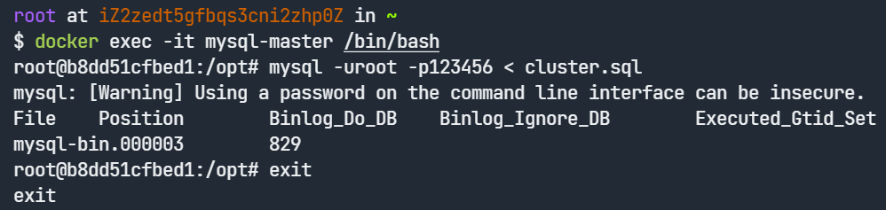

<!--
 * @Author: Karigen B
 * @Date: 2022-10-03 19:15:47
 * @LastEditors: Karigen B
 * @LastEditTime: 2022-10-07 08:15:18
 * @Description: 
 * @FilePath: \undefinedd:\CodeSpace\SQLSpace\MySQL-cluster\README.md
-->

# MySQL-cluster

- 部署步骤:
  1. 由于可能存在网络问题,所以先看 [@java赵先生](https://blog.csdn.net/weixin_53974140/article/details/122959471) 的这篇博客
  2. cd到docker-compose.yml所在的目录,执行`docker-compose up -d`(可能会出现权限问题,以管理员权限cd,运行即可),等待容器初始化完毕
  3. 执行`docker exec -it mysql-master /bin/bash`,再执行`mysql -uroot -p123456 < cluster.sql`
  4. 此时会将File和Position打印出来,例如:将这两个值在 ==./slave-1/cnf/cluster.sql== 和 ==./slave-2/cnf/cluster.sql==中修改一下( ==master_log_file='mysql-bin.000003',master_log_pos=830== ,这两个),因为是在容器中运行的缘故,所以如果完全参照作者的步骤执行命令,MySQL的日志系统到目前为止的参数和作者预留的参数一致
  5. 执行`docker exec -it mysql-slave-1 /bin/bash`,再执行`mysql -uroot -p123456 < cluster.sql`
  6. 执行`docker exec -it mysql-slave-2 /bin/bash`,再执行`mysql -uroot -p123456 < cluster.sql`
  7. 集群部署完毕
  8. 集群停止命令:cd到docker-compose.yml所在的目录,执行`docker-compose stop`
  9. 集群删除命令:cd到docker-compose.yml所在的目录,执行`docker-compose down -v`

- 项目结构
  - MySQL一主二从集群,通过Nginx做从服务器的负载均衡
  - MySQL主服务器端口映射到宿主机3307端口
  - Nginx端口映射到宿主机3308端口

**注意**:
  - 集群中所有节点的root密码都是123456,可以自行从cluster.env中修改
  - 由于在Windows中所有的文件权限都是777,所以在执行命令的时候由于Windows文件权限太低,MySQL会忽略my.cnf文件,所以**不要在Windows环境中运行**
  - 由于作者懒得做镜像了,所以就依次执行吧

本项目专门为**北京邮电大学2020级软件工程数据库课设&&云计算第二次实验**准备

--by Karigen(**学二507地位最高的男人**)